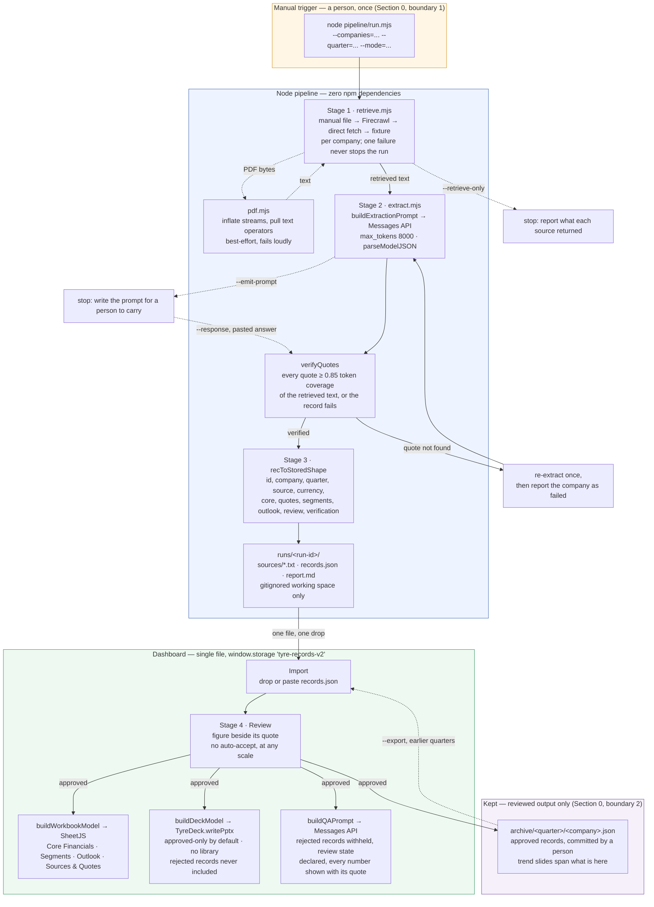

# Architecture

Why this is two programs instead of one, how they stay in agreement, and what happens to
a filing between the website it came from and a number in a workbook cell.

## Why the pipeline is not in the browser

The spec's Section 1 says to build on the existing dashboard rather than rebuild it, and
the dashboard already had a working extraction path: paste or upload filing text, call
the Anthropic Messages API, store the record. That path still exists and still works.
What it cannot do is Stage 1.

Retrieval means fetching from NSE, BSE, and nine companies' investor-relations sites.
None of those origins send `Access-Control-Allow-Origin`, so a `fetch()` from a page on
`localhost` (or from `file://`, or from a hosted artifact) is blocked by the browser
before the response is ever readable. This is not a header we can talk our way around
from the client: CORS is enforced by the browser on behalf of those origins, and they
have no reason to opt us in. A browser-only build would be permanently stuck at "the
operator downloads nine PDFs by hand first", which is the fallback path, not the main
one.

The spec anticipates this. Section 4, Stage 3 says: *"If running outside the dashboard's
own runtime (a standalone script rather than inside the artifact), write matching JSON
locally and provide a clear one-step import into the dashboard."* That is the split we
took. Node has no same-origin policy, can follow a redirect to a PDF, can inflate its
streams, and can hold an API key in a process environment instead of a text input. The
dashboard keeps everything a person actually looks at: review, comparison, the workbook,
Q&A.

The handoff between them is a file. `runs/<run-id>/records.json` is written by the
pipeline and imported by the dashboard in one drop, and the records land in exactly the
shape the dashboard's own extraction path produces, under the same storage key
(`tyre-records-v2`). Neither side knows or cares which produced a given record.

## One contract, two runtimes

Both halves need the same schema, the same stored-shape transform, the same quote
verification, the same prompts and the same workbook model. Two copies of that would
drift within a week, and the drift would be silent — a workbook column that no longer
matches what the extractor produces looks fine until someone reads it.

So there is exactly one copy of each: `pipeline/lib/core-source.js` holds the contract,
and `pipeline/lib/deck-source.js` holds the PowerPoint renderer that turns part of it into
a file. Both are written as plain browser scripts — no imports, no exports, no top-level
await — with everything hanging off a `TyreCore` / `TyreDeck` object, bracketed by
`/* ==== TYRE-CORE:BEGIN ==== */` and `TYRE-DECK` markers respectively.

- **The dashboard** contains that text inlined verbatim between the same markers, so it
  stays a genuinely single file with no build step.
- **Node** loads them through `pipeline/lib/core.mjs` and `pipeline/lib/deck.mjs`, which
  read the files, evaluate them in this realm with `window` and `globalThis` shadowed, and
  re-export what they define: `import { TyreCore } from './core.mjs'`.
- **`scripts/sync-core.mjs`** copies both canonical blocks into the dashboard; `--check`
  exits non-zero instead of writing.
- **The drift test** in `test/` runs that same check, so `npm test` fails the moment the
  two disagree. Editing the inlined copy by hand is a test failure, not a mystery.

The rule that falls out of this: never reimplement anything `TyreCore` already does. If
something is missing, work around it in your own module and say so, rather than growing a
second definition of the contract.

The split between the two is worth keeping. `core-source.js` is data — the schema,
transforms, verification, prompts, and the workbook and deck *models*, which are arrays
and objects the tests assert on directly without opening a file. `deck-source.js` is
rendering — the ZIP container and the OOXML that turn a deck model into bytes. Anything
that decides what a slide says belongs in the first; anything that decides how it is
drawn belongs in the second.

## The journey of a filing

Reading the same path in prose:

1. **Retrieved text.** `retrieveFiling()` tries, in order: an operator-supplied local file,
   Firecrawl (only when `FIRECRAWL_API_KEY` is set), a direct HTTP fetch of each source in
   `companies.mjs`, and — in fixture mode only — the synthetic filing on disk. A response
   under a few hundred useful characters is treated as a cookie wall or a JavaScript
   shell and fails over rather than being sent to the extractor. The text is written to
   `runs/<run-id>/sources/<id>.txt`: working space for this run, gitignored, never synced
   (Section 0, boundary 2).

2. **Extraction.** `TyreCore.buildExtractionPrompt()` assembles the system prompt whose
   guardrails are the point — never fabricate a quote, never estimate a number, detect
   currency and unit explicitly — plus the schema and the source text. Section 4 flags the
   original 60,000-character truncation as a risk on a full quarterly report;
   `selectFinancialText()` raises the budget to 400,000 characters and, when a document
   still exceeds it, keeps the head of the document for company and quarter context plus
   the densest financial-statement window rather than blindly taking the first N
   characters. The response is recovered with `parseModelJSON()`, which tolerates a fence
   or a stray sentence. No prefill, no temperature.

3. **Quote verification.** This is where "never fabricate a quote" is actually enforced,
   and it asks two separate questions of every non-empty quote.

   *Is the quote real?* Exact substring first; failing that, a sliding window finds spans
   whose bag of words is close, and those candidates are re-scored by longest common
   subsequence so word order counts, thresholded at 0.85. Order matters because a quote
   reassembled from the document's own words in an order it never used says something the
   filing does not — scoring on the bag alone gave such a quote a perfect match.

   *Is the number in it?* A genuine quote does not prove it is the sentence the figure
   came from. These filings put three or four comparative columns side by side, so a model
   can quote a real row label and report the prior quarter's number from it. The figure
   must appear in its own quote, with a tolerance for rounded percentages, parentheses
   read as the accounting convention for a loss, and period labels like `FY26` or `Q1`
   scrubbed first so they cannot stand in for the figure they label.

   A value reported with no quote at all is recorded as `unquoted`, and that fails the
   record. It used to be recorded and allowed through, on the reasoning that a missing
   quote is not a fabricated one — which left the gate open completely: a record of
   twenty-one invented figures with no quotes anywhere passed and was stored. The prompt's
   own rule is that a figure you cannot quote is returned as null. A failure re-extracts once, naming the fields that failed, and then reports
   that company as failed with the offending quotes attached, while the other eight carry
   on.

4. **Stored shape.** `recToStoredShape()` converts the model's schema into the record the
   dashboard stores, field for field: anything not reported stays `null`, quotes stay
   exactly as returned. The runner stamps on what only it knows — source, retrieval
   timestamp, verification result — and sets `review.status: "pending"`. Extraction
   produces candidates; it never produces accepted records.

5. **Review.** The dashboard's review screen puts every company's figures next to their
   quotes so nine records are one pass, not nine. There is no auto-accept path at any
   scale. This gate is the safety property of the whole design, and it is the specific
   thing that Phase 2 automation would remove.

6. **Workbook, deck and Q&A.** All three read from the same stored records, and all are explicit
   about review state rather than assuming it. `buildWorkbookModel()` returns a
   renderer-agnostic model — sheets as arrays of arrays, plus the cell comments keyed
   `COMPANY|QUARTER|metric` that tie every Core Financials cell to its Sources & Quotes
   row — which the dashboard hands to SheetJS and the tests assert on directly without
   ever opening a spreadsheet. Passing `{ reviewedOnly: true }` restricts it to approved
   records, which is what the dashboard's export does by default. `buildQAPrompt()` drops
   any record a human rejected, tells the model how many of the rest are approved versus
   still pending, and serializes them whole so cross-company questions work, under a
   system prompt that makes those records the entire world.

   `buildDeckModel()` applies the same review rule for a stronger reason: a deck
   circulates further than a spreadsheet and gets read out of context, so a rejected
   record is never on one under any option, and approved-only is the default rather than a
   toggle. Where the selected records span several quarters it compares the latest and
   turns the rest into trend slides, because a comparison table built from all of them
   would list each company once per quarter and read as though they were different
   companies. `TyreDeck.writePptx()` renders that model to a `.pptx` with no library on
   either side — the package is a ZIP of XML, entries stored rather than deflated so the
   same writer works in a browser with no zlib.

   One honest caveat on formatting: the dashboard loads the SheetJS community build,
   whose writer ignores per-cell styling (`cell.s`). Column widths and cell comments
   survive the round trip; bold headers and fills do not, and freeze panes are set but
   unverified against the real library. The data and the
   traceability are unaffected, which is what the workbook is actually for.

## Working without a key

The API key is the one thing that cannot be engineered around, so three routes exist to
keep everything else demonstrable. `--retrieve-only` stops after Stage 1 and reports what
each source returned, counting financial-statement markers so a cookie wall that answered
200 is a failure rather than thin success. `--emit-prompt` writes exactly what would have
gone over the wire and sends nothing. `--response=<id>:<path>` reads an answer a person
carried out of a Claude chat and puts it through the same
`parseModelJSON → recToStoredShape → validateStored → verifyQuotes` path an API answer
takes, against the same retrieved text.

The last of these is the one to be careful about, and it is where the tests concentrate:
carrying the answer by hand must not become a way around the quote gate. It is not — a
fabricated quote is rejected, and so is a genuine quote carrying a figure that is not in
it. Records that arrive this way are stamped `claude-manual` rather than `claude:<model>`,
so a reader can always tell which crossed the network and which were carried.

## The archive, and the line it sits on

Boundary 2 forbids archiving *scraped source documents* unattended and names *reviewed
output* as the permitted destination. `pipeline/archive.mjs` lives on exactly that
distinction: it keeps records a person approved, one file per company per quarter under
`archive/`, committed by that same person — and refuses anything unapproved by name.
Retrieved text stays in `runs/`, gitignored, and never reaches it. A record already
archived is compared on its figures and quotes rather than on who signed it off, so a
re-review is not a change, while an actual change is reported and held until someone looks
at it.

## Consequences worth knowing

- **The workbook model is data, not a spreadsheet.** Formatting decisions (widths, freeze
  panes, wrapped columns) travel with the model, so the renderer stays thin and the
  structure is testable offline.
- **Fixture mode is a first-class path, not a mock.** It runs the same retrieval,
  extraction contract, verification, storage shape and review flow as a live run; only
  the source of the text and the extraction engine differ. That is what makes the whole
  system demonstrable with no key and no network — and why the fixtures are marked
  synthetic on their first line, so nobody mistakes a demo number for a filing.
- **The archive is the only thing that outlives a run, and only a person puts it there.**
  Nothing writes to `archive/` without an explicit command naming a records file, and
  nothing unapproved goes in at all.
- **Nothing in either half schedules work.** The Node client's retry loop bounds a single
  in-flight HTTP request and then gives up with a reportable error. There is no queue, no
  resume, and no code path that starts a run without a person.
